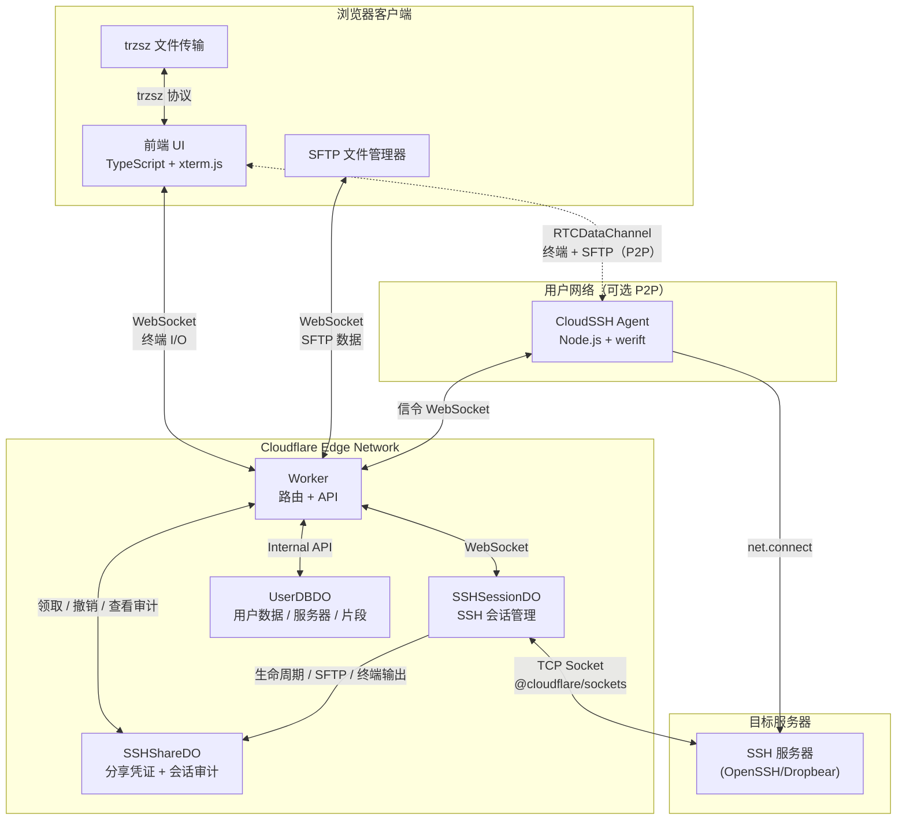

<div align="center">
  
  <p>基于 Cloudflare Workers 的 Serverless Web SSH 终端</p>
  <p>
    <a href="LICENSE"></a>
    
    
    
  </p>
  <p>
    <a href="README.md">简体中文</a> |
    <a href="README_en.md">English</a>
  </p>
</div>

CloudSSH 是一个运行在 Cloudflare Workers 上的浏览器 SSH 客户端。浏览器通过 WebSocket 连接边缘 Worker，Worker 使用 TCP Socket 直连目标 SSH 服务器。无需安装本地客户端，也无需自建后端。

对于登录用户，CloudSSH 还支持可选的 **P2P Agent 模式**：在你的网络中运行一个轻量 Agent，浏览器经 WebRTC DataChannel 直连 Agent，由 Agent 向 SSH 目标发起 TCP 连接。此模式下 Cloudflare 仅承担信令与元数据，数据面不再经过 Worker，同时可触达 Worker 无法直连的内网主机。

## 功能特性

### SSH 终端

- **纯 TypeScript SSH-2.0 协议栈**：不依赖第三方 SSH 库，全部加密操作基于 Web Crypto API（Curve25519-SHA256 / ECDH-NISTP256 密钥交换、AES-256-GCM/CTR、HMAC-SHA2），兼容 OpenSSH 与 Dropbear。
- **多种认证方式**：密码、RFC 4256 `keyboard-interactive` 多轮交互认证（密码/OTP/二次验证），以及 OpenSSH 格式 Ed25519、ECDSA P-256/P-384/P-521、RSA 私钥；RSA 默认使用 SHA2-256/512。
- **主机指纹验证（TOFU）**：首次连接展示 SHA-256 指纹并做签名校验，已知主机指纹同时缓存在本地与云端；`STRICT_HOST_KEY_VERIFY` 默认开启（fail-closed）。
- **IPv4/IPv6 双栈**：完整支持两种地址族，含 IPv6 方括号写法。
- **xterm.js 终端**：WebGL 硬件加速渲染、选区自动复制、右键粘贴（bracketed paste）、`Ctrl+Shift+F`/`Cmd+F` 日志检索、清屏快捷键、终端日志一键导出。
- **多标签会话**：单页面内开启多个独立 SSH 会话，支持双击重命名与右键菜单（克隆会话、关闭其他等）。
- **移动端适配**：可视高度与安全区适配、软键盘处理、iOS 中文输入法兼容、快捷键栏、选区复制模式、断线自动重连。

### SFTP 文件管理

- 完整的 SFTP v3 子系统实现，与终端会话并行运行。
- 面包屑导航、按名称/大小/时间多维排序、多选/连选/全选、批量下载与删除、上传取消。
- 内置 CodeMirror 在线编辑器：可直接编辑远端文本文件（≤2MB、UTF-8 可编辑、GBK/GB18030 只读识别），保留换行符与 BOM，保存前检测远端修改，常用配置语法高亮。
- [trzsz](https://trzsz.github.io/) 集成：`trz`/`tsz` 命令、拖拽上传、目录传输与断点续传（需远端安装 trzsz）。

### 服务器管理（GitHub 登录后可用）

- 保存常用服务器并一键连接；服务端解密凭据后经一次性令牌传递给会话，浏览器不接触明文。
- 服务器标签（每服务器最多 10 个）、按名称/主机/用户名即时搜索、响应式分页。
- **SSH 跳板链**：通过 RFC 4254 `direct-tcpip` 逐层建立连接，不依赖远端安装 `ssh`/`nc`/`socat`，最多 3 跳；每跳独立认证与主机指纹验证。
- **操作系统自动识别**：首次连接已保存服务器时，经独立 SSH exec 通道读取 `/etc/os-release` 或 `uname`，在服务器卡片显示系统图标；后台执行、不阻塞终端。
- **命令片段库**：`{{var}}` 参数占位符、分类筛选、模糊搜索、一键复制/填入/执行；登录用户云端存储（每用户 ≤100 条），匿名用户降级到 `localStorage`。
- 主题、已知主机指纹、匿名连接历史（本地 AES-256-GCM 加密，最近 5 条）等偏好持久化。

### P2P Agent 模式（可选）

- **WebRTC 直连**：浏览器与自托管 Agent 之间建立加密 DataChannel，终端与 SFTP 各走一条子通道；Cloudflare 侧只做 offer/answer 信令与元数据协调，不承载会话流量。
- **内网可达**：Agent 出站连接信令 DO，因此可代理 Worker 无法直达的 NAT/内网 SSH 主机，无需端口映射。
- **TURN 回退**：对称 NAT 或 UDP 受限网络经 Cloudflare Realtime TURN 中继（支持自建 TURN 兜底）；信令失败自动回落到普通 Worker 中继，分享等一次性票据场景透明降级复用同一连接。
- **断线恢复**：会话在 Agent 侧保持 60 秒宽限，恢复时轮换 resume token、重新签发 ICE/TURN 凭据；绑定设备的分享会话沿用签名挑战校验。
- **安全边界**：Agent 令牌形如 `<githubId>:<agentId>:<secret>`，服务端仅存哈希；支持目标主机白名单（`*.corp.local` 通配）、高危端口黑名单、并发会话上限；分享会话审计由 Agent 回传至 ShareDO，主机指纹验证与认证交互不变。

### 分享与安全

- **一次性 SSH 分享**（可选开启）：链接仅含 256 位随机能力凭证，只存哈希、只能领取一次，领取有效期与会话最长时限独立；所有者实时可撤销，并可查看该分享会话的生命周期、SFTP 操作与终端输出审计。
- **SSRF 防护**：IPv6/保留地址阻断 + DNS-over-HTTPS 防重绑定；Worker 内存限流。
- **访问控制**：Turnstile 人机验证、GitHub 数字 ID 白名单、`REQUIRE_GITHUB_AUTH` 强制登录模式（fail-closed）。
- **存储加密**：已保存凭据以 AES-256-GCM 加密存储于每用户 SQLite（UserDBDO）。
- **会话隔离**：每个终端会话由独立 Durable Object 管理，活动 SSH TCP 连接使会话保持唤醒；可配置空闲超时（默认 30 分钟）。

## 架构



前端不是独立部署的：`scripts/build-html.js` 将 Vite 产物内联为单个 HTML 写入 `src/worker/html.ts`（自动生成，勿手改），由 Worker 直接返回。

## 部署

### 前置要求

- Cloudflare 账号，并启用 Workers（TCP Sockets 与 Durable Objects 必需）。

### 方式一：Cloudflare Git 集成（推荐）

1. Fork 本仓库到你的 GitHub 账号。
2. Cloudflare Dashboard → Workers & Pages → 创建应用 → 连接 GitHub，选择该 Fork。
3. 构建命令填写 `pnpm run build:frontend`，保存并部署。
4. 部署后经 `https://<worker-name>.<子域>.workers.dev` 访问；可在 Settings → Domains & Routes 绑定自定义域名。

### 方式二：Wrangler CLI

```bash
pnpm install
cd frontend && pnpm install
npx wrangler login        # 首次需要
pnpm run deploy           # 构建前端并部署 Worker
```

### 环境变量

所有可选功能均由 Worker 环境变量控制，在 Cloudflare Dashboard 的 **Settings → Variables and Secrets** 中配置（敏感值请选择 **Secret** 类型）：

| 环境变量 | 是否必填 | 默认值 | 说明 |
| --- | --- | --- | --- |
| `IDLE_TIMEOUT` | 可选 | `30m` | 无操作空闲超时（支持 `30m`/`1h`/`1800s`/`1800`；`0` 禁用）。超时前 60s 输出预警，任意输入即续期。 |
| `GITHUB_CLIENT_ID` | 启用登录时必填 | 无 | GitHub OAuth App Client ID，与 `GITHUB_CLIENT_SECRET`、`BASE_URL` 配套。 |
| `GITHUB_CLIENT_SECRET` | 启用登录时必填 | 无 | GitHub OAuth App Client Secret。**必须设为 Secret**。 |
| `BASE_URL` | 启用登录时必填 | 无 | 站点公网根地址（如 `https://ssh.example.com`），需与 OAuth App 回调地址一致，末尾不加 `/`。 |
| `GITHUB_ALLOWED_USER_IDS` | 可选 | 不限制 | 允许登录的 GitHub 数字用户 ID 白名单（英文逗号分隔）；配置后 fail-closed。 |
| `REQUIRE_GITHUB_AUTH` | 可选 | `false` | `true` 时禁用匿名 SSH，所有连接必须持有有效 GitHub 会话。 |
| `TURNSTILE_SITEKEY` / `TURNSTILE_SECRET` | 可选 | 无 | Turnstile 人机验证站点密钥与服务端密钥；任一为空则该功能关闭。 |
| `ENABLE_SSH_SHARING` | 可选 | `false` | `true` 时允许登录用户创建一次性受控 SSH 分享。 |
| `ENABLE_P2P` | 可选 | `false` | `true` 时开放 Agent 注册与信令 API，登录用户可在连接时选择经自托管 Agent 的 P2P 通道。 |
| `TURN_KEY_ID` / `TURN_API_TOKEN` | P2P 建议配置 | 无 | Cloudflare Realtime TURN key，服务端为每个会话签发短时 ICE 凭据；缺失时仅下发公共 STUN。 |
| `TURN_EXTRA_URIS` | 可选 | 无 | 逗号分隔的自建 TURN 地址（如 `turn:turn.example.com:443?transport=tcp`），追加进 `iceServers` 兜底。 |
| `TURN_EXTRA_USERNAME` / `TURN_EXTRA_CREDENTIAL` | 可选 | 无 | 与 `TURN_EXTRA_URIS` 配套的静态凭据。 |
| `STRICT_HOST_KEY_VERIFY` | 可选 | `true` | 主机公钥签名严格校验；**生产环境保持默认**。 |
| `DEBUG_MODE` | 可选 | `false` | 输出底层握手与诊断日志，仅排障时临时开启。 |

> `MAX_CONNECTIONS` 为代码中预留的变量声明，当前版本未读取，请勿依赖。

### 可选：Turnstile 人机验证

1. Cloudflare Dashboard → Turnstile → 创建 Widget，获得 Site Key 与 Secret Key。
2. 在 Worker 的 Variables and Secrets 中设置 `TURNSTILE_SITEKEY` 与 `TURNSTILE_SECRET`。
3. 重新部署生效。

### 可选：GitHub OAuth 与服务器管理

1. GitHub → Settings → Developer settings → OAuth Apps → New OAuth App：
   - Homepage URL：`https://your-domain.com`
   - Authorization callback URL：`https://your-domain.com/api/auth/callback`
2. 在 Worker 环境变量中设置 `GITHUB_CLIENT_ID`、`GITHUB_CLIENT_SECRET`、`BASE_URL`。
3. 按需追加：`GITHUB_ALLOWED_USER_IDS`（数字 ID 白名单，见 `https://api.github.com/users/<name>` 的 `id` 字段）、`REQUIRE_GITHUB_AUTH=true`（禁用匿名连接）、`ENABLE_SSH_SHARING=true`（启用分享）。
4. 重新部署。未配置 OAuth 时登录入口自动隐藏，匿名 SSH 不受影响。

| 配置组合 | GitHub 登录 | 匿名 SSH |
| --- | --- | --- |
| 两项都不配置 | 所有 GitHub 用户 | 允许 |
| 仅配置 `GITHUB_ALLOWED_USER_IDS` | 仅白名单用户 | 允许 |
| 仅配置 `REQUIRE_GITHUB_AUTH=true` | 所有 GitHub 用户 | 禁止 |
| 两项同时配置 | 仅白名单用户 | 禁止 |

### 使用一次性 SSH 分享

1. 配置 GitHub OAuth 并设置 `ENABLE_SSH_SHARING=true`，重新部署。
2. 所有者先通过普通连接完成目标服务器及全部跳板的主机指纹验证。
3. 在服务器卡片点击分享，选择领取有效期（5/15/30/60 分钟）与会话最长时间（15/30/60/120 分钟）。
4. 创建后立即复制链接——明文凭证只显示一次，服务端不保存。
5. 接收者打开链接领取授权；链接只能成功领取一次，断开或关闭页面后不能重连。
6. 所有者可在分享管理中查看状态与审计记录，或撤销待领取/活动分享。

> 分享凭证持有者可获得所有者保存凭据对应的完整 Shell 与 SFTP 权限，应按临时密码保护。审计记录保存 PTY 输出而不保存键盘输入，属于会话留痕而非目标机级强审计；单次记录上限 5 MiB。

### 使用 SSH 跳板

需启用 GitHub OAuth 并使用已保存服务器：

1. 保存可由 Cloudflare 直接访问的最外层跳板服务器 A。
2. 保存目标服务器 B，并在其“跳板服务器”中选择 A；B 可使用仅 A 可达的内网地址。
3. 多级路径（C → A → B）通过递归解析，最多 3 台跳板。
4. 连接 B 后终端与 SFTP 均在最终目标上运行；任一跳断开将重建或关闭整条链路。

跳板链必须属于同一用户空间，不允许自引用或循环；被引用的跳板不能直接删除。SSRF 公网检查与 DO 区域调度均以 Cloudflare 直连的最外层入口为准；只有该入口会执行 IPinfo 区域推断，下游内网地址不会外泄。每跳独立执行 TOFU 验证，内网目标的主机指纹按完整跳转路径隔离。

### 使用 P2P Agent 模式

P2P 模式要求 GitHub 登录（Agent 绑定到账号）。服务端配置 `ENABLE_P2P=true`，并按需配置 TURN：

```bash
# Cloudflare Realtime TURN（推荐）：Realtime → 创建 TURN key 得到 key id 与 API token
TURN_KEY_ID=<key id>
TURN_API_TOKEN=<api token>   # 设为 Secret

# 可选：自建 coturn 兜底（UDP 受限/对称 NAT 环境更稳）
TURN_EXTRA_URIS=turn:turn.example.com:443?transport=tcp
TURN_EXTRA_USERNAME=cloudssh
TURN_EXTRA_CREDENTIAL=<static secret>
```

**推荐路径——免手动安装（bootstrap）**：按常规方式用中继连接一台已保存的 Linux/macOS 服务器后，前端会自动探测目标机上的 Agent：

- **已安装且运行中** → 自动绑定该服务器并切换 P2P（无需操作）；
- **已安装未运行** → 询问是否远端启动（systemd 系统服务需 sudo 密码）；
- **未安装** → 询问是否安装：用户级（免 sudo，`~/.local/bin` + `systemd --user`/launchd 自启）或系统级（sudo，`/usr/local/bin` + 系统 unit）。同意后自动创建 Agent、经当前 SSH 会话下发安装命令、等待上线、绑定并切换 P2P。

全程秘密安全：Agent 令牌与 sudo 密码只经 SSH exec stdin 传输，不出现在远端命令行/`ps`；任何一步拒绝或失败都保持中继，中继此后只承担引导与兜底。此后连接该服务器自动走 P2P（Agent 与目标同机时目标改写 `127.0.0.1`）。

**手动路径（网关/其他机器安装）**：想把 Agent 装在与 SSH 目标不同的机器上做内网网关时，在服务器列表工具栏打开 **Agent** 面板创建并**立即复制令牌**（明文只返回一次，服务端仅存哈希），令牌下方给出内嵌令牌与站点地址的一键安装命令：

```bash
# Linux / macOS —— 下载免安装二进制、写入 600 权限配置、注册开机自启（systemd --user / launchd）
curl -fsSL https://<你的站点>/install.sh | sh -s -- --token <githubId>:<agentId>:<secret>

# Windows（PowerShell）—— 下载 exe 并注册登录计划任务
iex "& { $(irm https://<你的站点>/install.ps1) } -Token '<githubId>:<agentId>:<secret>'"
```

二进制由 CI 以 Node SEA 构建（linux/darwin/windows × x64/arm64），目标机无需 Node.js。下载走多镜像回退：本站代理 → workers.dev 代理 → GitHub 直连，被墙或机房网络都能完成下载。**Agent 回连（信令 WS + 审计/OS 回传）默认指向 workers.dev 源**——自定义域名可能对机房 IP 弹出 CF 托管挑战（403），workers.dev 不经挑战；若取脚本本身被拦，可将命令中的域名换成 workers.dev 地址。可选 `--system`（root 路径 + 系统 unit）、`--no-service` 只前台运行、`--server` 显式覆盖回连源。手动方式（Node.js ≥ 20 + 源码）：`cd agent && pnpm install && pnpm run build && node dist/agent.js --token <令牌>`，参数亦可全部走环境变量（`AGENT_TOKEN`/`AGENT_SERVER`/`AGENT_SIGNAL_URL`/`AGENT_ALLOWLIST`/`AGENT_MAX_SESSIONS`/`AGENT_DEBUG`）。

Agent 上线后面板会询问是否切换到 P2P；也可随时在「连接传输」中手动选择（默认仍为中继）。浏览器先经 DO 信令与 Agent 完成 ICE/DTLS 握手，终端与 SFTP 随后跑在 DataChannel 上；信令超时或协商失败自动回落中继（分享链接透明降级，不消耗第二次票据）。

> 注意事项：凭据解密发生在服务端，`session_init` 经信令通道下发给 Agent（与现有中继路径的信任模型一致）；P2P 分享会话的审计由 Agent 回传，属于应用层留痕；Agent 机器即新的网络信任边界，建议配合 `--allowlist` 收敛可代理的目标范围。

## 开发

### 环境准备

- Node.js 22、pnpm 11.8（`pnpm-workspace.yaml` 启用了供应链约束：发布不足 7 天的依赖版本会被 `minimumReleaseAge` 拦截）。
- `wrangler login`：本地开发需要连接 Cloudflare 账号以使用 Durable Objects 与 TCP Sockets。

```bash
git clone <本仓库地址> && cd CloudSSH
pnpm install
cd frontend && pnpm install
```

### 常用命令

| 命令 | 说明 |
| --- | --- |
| `pnpm run dev` | 构建前端并启动 Wrangler 本地开发（默认 `http://localhost:8787`） |
| `pnpm run build:frontend` | 构建前端并重新生成 `src/worker/html.ts` |
| `pnpm run typecheck` | Worker 与前端 TypeScript 类型检查 |
| `pnpm test` | Vitest 单元与集成测试 |
| `pnpm run test:e2e` | Playwright 浏览器 E2E 与 axe 无障碍回归（首次需 `pnpm exec playwright install chromium`） |
| `pnpm run verify` | 完整质量门禁：typecheck → test → build → e2e |
| `pnpm run deploy` / `deploy:test` | 部署生产 / 测试 Worker |

### 项目结构

```
CloudSSH/
├── src/
│   ├── ssh/                  # 纯 TypeScript SSH-2.0 协议栈与 SFTP v3 实现
│   ├── worker/               # Worker 入口与 Durable Objects
│   │   ├── index.ts          # 路由、API、内存限流
│   │   ├── durable-object.ts # SSHSessionDO：WebSocket ↔ TCP 桥接与会话生命周期
│   │   ├── ssh-session.ts    # SSH 会话状态机与多通道路由
│   │   ├── sftp-handler.ts   # SFTP 操作与传输队列
│   │   ├── exec-channel.ts   # SSH exec 通道（远端 OS 检测）
│   │   ├── user-db.ts        # UserDBDO：用户/服务器/片段/主题/已知主机（SQLite）
│   │   ├── share-do.ts       # SSHShareDO：分享凭证生命周期与审计
│   │   └── html.ts           # 自动生成，勿直接编辑
│   └── types.ts              # 共享类型（Env、消息协议等）
├── frontend/
│   └── src/                  # TypeScript + xterm.js + Tailwind 前端
├── agent/                    # P2P Agent：Node.js + werift，DataChannel ↔ SSH TCP 网关
├── docs/theme-editor/        # 可视化主题编辑器（经 GitHub Pages 发布）
├── scripts/build-html.js     # 前端构建并内联生成 src/worker/html.ts
├── tests/                    # Vitest 单元/集成 + Playwright/axe E2E
├── .github/workflows/        # CI：部署与 GitHub Pages
└── wrangler.toml             # Workers 与 Durable Objects 配置
```

变更提交前请运行 `pnpm run verify`；`src/worker/html.ts` 由构建生成，任何前端改动都应通过 `pnpm run build:frontend` 落地。

## 许可证

本项目基于 [Apache License 2.0](LICENSE) 分发。修改或再发布时须保留 [LICENSE](LICENSE) 与 [NOTICE](NOTICE) 中的版权与归属声明。
