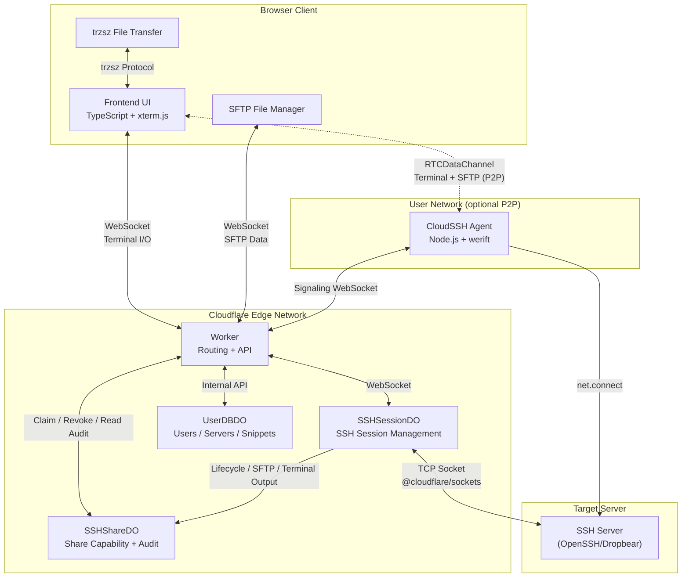

<div align="center">
  
  <p>A serverless Web SSH terminal built on Cloudflare Workers</p>
  <p>
    <a href="LICENSE"></a>
    
    
    
  </p>
  <p>
    <a href="README.md">简体中文</a> |
    <a href="README_en.md">English</a>
  </p>
</div>

CloudSSH is a browser-based SSH client running on Cloudflare Workers. The browser connects to an edge Worker over WebSocket, and the Worker opens a direct TCP socket to the target SSH server. No local client installation and no self-hosted backend required.

For signed-in users, CloudSSH also offers an optional **P2P Agent mode**: run a lightweight agent inside your network, and the browser connects to it over a WebRTC DataChannel while the agent opens the TCP connection to the SSH target. In this mode Cloudflare only carries signaling and metadata — session traffic never touches the Worker — and the agent can reach internal hosts that are unreachable from the edge.

## Features

### SSH Terminal

- **Pure TypeScript SSH-2.0 stack**: no third-party SSH library; all cryptography is implemented on Web Crypto API (Curve25519-SHA256 / ECDH-NISTP256 key exchange, AES-256-GCM/CTR, HMAC-SHA2). Compatible with OpenSSH and Dropbear.
- **Multiple auth methods**: password, multi-round RFC 4256 `keyboard-interactive` authentication (password/OTP/second factor), and OpenSSH-format Ed25519, ECDSA P-256/P-384/P-521, and RSA private keys. RSA uses SHA2-256/512 by default.
- **Host-key verification (TOFU)**: SHA-256 fingerprint display and signature verification on first connect; known-host fingerprints are cached locally and in the cloud. `STRICT_HOST_KEY_VERIFY` is enabled by default (fail-closed).
- **IPv4/IPv6 dual stack**: both address families, including bracketed IPv6 notation.
- **xterm.js terminal**: WebGL-accelerated rendering, copy-on-select, right-click paste (bracketed paste), in-terminal search (`Ctrl+Shift+F`/`Cmd+F`), clear-screen shortcuts, one-click log export.
- **Multi-tab sessions**: multiple isolated SSH sessions in a single page, with double-click rename and a context menu (duplicate session, close others, etc.).
- **Mobile support**: visual-viewport and safe-area handling, soft-keyboard support, iOS CJK IME compatibility, shortcut bar, selection-copy mode, automatic reconnection.

### SFTP File Manager

- Complete SFTP v3 subsystem implementation running alongside the terminal session.
- Breadcrumb navigation, multi-column sorting (name/size/mtime), multi-select/range-select/select-all, batch download and delete, upload cancellation.
- Built-in CodeMirror editor: edit remote text files in place (≤2MB, UTF-8 editable, GBK/GB18030 read-only detection), preserves line endings and BOM, detects remote modification before saving, syntax highlighting for common configs.
- [trzsz](https://trzsz.github.io/) integration: `trz`/`tsz` commands, drag-and-drop upload, directory transfer and resume support (requires trzsz on the remote host).

### Server Management (GitHub sign-in)

- Save frequently used servers and connect in one click; the backend decrypts credentials and hands them to the session via a one-time token — the browser never sees plaintext.
- Up to 10 normalized tags per server, instant search by name/host/username, responsive pagination.
- **SSH jump chains**: standard RFC 4254 `direct-tcpip` per hop, no `ssh`/`nc`/`socat` required on remote hosts, up to 3 hops; each hop authenticates and verifies host keys independently.
- **Automatic OS detection**: on first connect to a saved server, a separate SSH exec channel reads `/etc/os-release` or `uname` and shows the system icon on the server card; runs in the background without blocking the terminal.
- **Command snippets**: `{{var}}` parameter placeholders, category filtering, fuzzy search, copy/fill/execute; cloud storage for signed-in users (≤100 per user), `localStorage` fallback for anonymous users.
- Per-user theme sync, cloud-persisted known-host fingerprints, encrypted anonymous connection history (local AES-256-GCM, last 5 entries).

### P2P Agent Mode (optional)

- **WebRTC direct connect**: the browser establishes an encrypted DataChannel with your self-hosted agent; terminal and SFTP each run on their own sub-channel. Cloudflare handles only offer/answer signaling and metadata — no session traffic.
- **Internal-network reachability**: the agent dials out to the signaling DO, so it can proxy SSH hosts behind NAT or on private networks without port forwarding.
- **TURN fallback**: symmetric NAT or UDP-restricted networks relay through Cloudflare Realtime TURN (self-hosted TURN can be appended as a fallback); signaling failures degrade automatically to the ordinary Worker relay, and share tickets transparently reuse the same connection.
- **Resume**: sessions linger for a 60-second grace window on the agent; resume rotates the resume token, re-mints ICE/TURN credentials, and keeps the device-signature challenge for bound share sessions.
- **Security boundary**: agent tokens look like `<githubId>:<agentId>:<secret>` — the server stores only a hash. Target allowlists (`*.corp.local` wildcards), a blocked high-risk port list, and a concurrent-session cap are enforced; share-session audit events are forwarded by the agent to ShareDO, and host-key verification plus auth interaction are unchanged.

### Sharing & Security

- **One-time SSH sharing** (opt-in): the link contains only a 256-bit random capability — stored as a hash, claimable once, with independent claim and session lifetimes. Owners can revoke in real time and review per-share lifecycle, SFTP, and terminal-output audit records.
- **SSRF protection**: IPv6/reserved-address blocking plus DNS-over-HTTPS anti-rebinding; bounded in-memory rate limiting on the Worker.
- **Access control**: Turnstile bot verification, GitHub numeric-ID allowlist, `REQUIRE_GITHUB_AUTH` mode (fail-closed).
- **Storage encryption**: saved credentials are AES-256-GCM encrypted in per-user SQLite storage (UserDBDO).
- **Session isolation**: each terminal session is managed by an independent Durable Object; an active SSH TCP connection keeps it awake. Configurable idle timeout (30 minutes by default).

## Architecture



The frontend is not deployed separately: `scripts/build-html.js` inlines the Vite build into a single HTML document written to `src/worker/html.ts` (generated — do not edit), which the Worker serves directly.

## Deployment

### Prerequisites

- A Cloudflare account with Workers enabled (TCP Sockets and Durable Objects are required).

### Option A: Cloudflare Git Integration (recommended)

1. Fork this repository to your GitHub account.
2. Cloudflare Dashboard → Workers & Pages → Create application → Connect GitHub, select the fork.
3. Set the build command to `pnpm run build:frontend`, save and deploy.
4. Access the app at `https://<worker-name>.<subdomain>.workers.dev`; bind a custom domain under Settings → Domains & Routes if needed.

### Option B: Wrangler CLI

```bash
pnpm install
cd frontend && pnpm install
npx wrangler login        # first time only
pnpm run deploy           # builds the frontend and deploys the Worker
```

### Environment Variables

All optional features are controlled by Worker environment variables under **Settings → Variables and Secrets** in the Cloudflare Dashboard (mark sensitive values as **Secret**):

| Variable | Required | Default | Description |
| --- | --- | --- | --- |
| `IDLE_TIMEOUT` | Optional | `30m` | Idle timeout (`30m`/`1h`/`1800s`/`1800`; `0` disables). Warns 60s before disconnect; any input resets it. |
| `GITHUB_CLIENT_ID` | Required for login | — | GitHub OAuth App Client ID; used with `GITHUB_CLIENT_SECRET` and `BASE_URL`. |
| `GITHUB_CLIENT_SECRET` | Required for login | — | GitHub OAuth App Client Secret. **Must be stored as a Secret**. |
| `BASE_URL` | Required for login | — | Public root URL (e.g. `https://ssh.example.com`); must match the OAuth callback URL exactly, no trailing `/`. |
| `GITHUB_ALLOWED_USER_IDS` | Optional | Unrestricted | Comma-separated numeric GitHub user ID allowlist; fail-closed once set. |
| `REQUIRE_GITHUB_AUTH` | Optional | `false` | `true` disables anonymous SSH; every connection needs a valid GitHub session. |
| `TURNSTILE_SITEKEY` / `TURNSTILE_SECRET` | Optional | — | Turnstile site key and secret; the feature is off when either is unset. |
| `ENABLE_SSH_SHARING` | Optional | `false` | `true` lets signed-in users create one-time controlled SSH shares. |
| `ENABLE_P2P` | Optional | `false` | `true` opens the agent registry and signaling APIs; signed-in users can then pick a self-hosted agent's P2P channel when connecting. |
| `TURN_KEY_ID` / `TURN_API_TOKEN` | Recommended for P2P | — | Cloudflare Realtime TURN key; the server mints short-lived ICE credentials per session. Without it only public STUN is offered. |
| `TURN_EXTRA_URIS` | Optional | — | Comma-separated self-hosted TURN URIs (e.g. `turn:turn.example.com:443?transport=tcp`), appended to `iceServers` as fallback candidates. |
| `TURN_EXTRA_USERNAME` / `TURN_EXTRA_CREDENTIAL` | Optional | — | Static credentials paired with `TURN_EXTRA_URIS`. |
| `STRICT_HOST_KEY_VERIFY` | Optional | `true` | Strict host-key signature verification; **keep enabled in production**. |
| `DEBUG_MODE` | Optional | `false` | Verbose handshake/diagnostic logging; enable only for troubleshooting. |

> `MAX_CONNECTIONS` is a reserved declaration in the codebase and is not read by the current version — do not rely on it.

### Optional: Turnstile Bot Verification

1. Cloudflare Dashboard → Turnstile → create a Widget to obtain a Site Key and Secret Key.
2. Set `TURNSTILE_SITEKEY` and `TURNSTILE_SECRET` in the Worker's Variables and Secrets.
3. Redeploy.

### Optional: GitHub OAuth & Server Management

1. GitHub → Settings → Developer settings → OAuth Apps → New OAuth App:
   - Homepage URL: `https://your-domain.com`
   - Authorization callback URL: `https://your-domain.com/api/auth/callback`
2. Set `GITHUB_CLIENT_ID`, `GITHUB_CLIENT_SECRET`, and `BASE_URL` in the Worker environment.
3. Optionally add `GITHUB_ALLOWED_USER_IDS` (numeric-ID allowlist — see the `id` field at `https://api.github.com/users/<name>`), `REQUIRE_GITHUB_AUTH=true` (disable anonymous access), or `ENABLE_SSH_SHARING=true` (enable sharing).
4. Redeploy. Without OAuth configured, the login entry is hidden and anonymous SSH is unaffected.

| Configuration | GitHub login | Anonymous SSH |
| --- | --- | --- |
| Neither set | All GitHub users | Allowed |
| `GITHUB_ALLOWED_USER_IDS` only | Allowlisted users only | Allowed |
| `REQUIRE_GITHUB_AUTH=true` only | All GitHub users | Disabled |
| Both set | Allowlisted users only | Disabled |

### Using One-Time SSH Sharing

1. Configure GitHub OAuth, set `ENABLE_SSH_SHARING=true`, and redeploy.
2. The owner first connects normally to the target server and all jump hosts so every host key on the path is verified.
3. Click share on the server card and choose a claim window (5/15/30/60 min) and a session limit (15/30/60/120 min).
4. Copy the link immediately — the plaintext capability is shown only once and never stored.
5. The recipient opens the link and claims access; each link can be claimed exactly once and cannot reconnect after disconnecting or closing the page.
6. The owner can review share status and audit records, or revoke pending/active shares at any time.

> The capability holder gets full shell and SFTP access backed by the owner's saved credentials — treat it like a temporary password. The audit log records PTY output, not keystrokes; it is a session record, not host-level auditing. Per-share records are capped at 5 MiB.

### Using SSH Jump Hosts

Requires GitHub OAuth and saved servers:

1. Save the outermost jump host A, reachable directly by Cloudflare.
2. Save target server B and select A as its jump host; B may use a private address reachable only from A.
3. Multi-hop paths (C → A → B) resolve recursively, up to 3 jump hosts.
4. Connecting to B runs the terminal and SFTP on the final target; any hop failure rebuilds or closes the whole chain.

Jump chains must stay within one user space — no self-references or cycles; a jump host referenced by other servers cannot be deleted. SSRF public-address checks and DO region scheduling are evaluated against the outermost Cloudflare-facing entry only; that entry alone triggers IPinfo region inference, so downstream private addresses are never exposed. Every hop performs independent TOFU verification, and host fingerprints for private targets are scoped to the full jump path.

### Using P2P Agent Mode

P2P mode requires GitHub sign-in (agents are bound to your account). Set `ENABLE_P2P=true` on the Worker, and optionally configure TURN:

```bash
# Cloudflare Realtime TURN (recommended): Realtime → create a TURN key for key id + API token
TURN_KEY_ID=<key id>
TURN_API_TOKEN=<api token>   # store as Secret

# Optional: self-hosted coturn fallback (more reliable on UDP-restricted/symmetric NAT)
TURN_EXTRA_URIS=turn:turn.example.com:443?transport=tcp
TURN_EXTRA_USERNAME=cloudssh
TURN_EXTRA_CREDENTIAL=<static secret>
```

**Recommended path — no manual install (bootstrap)**: connect to a saved Linux/macOS server over the relay as usual; the frontend then automatically probes the target for an agent:

- **Installed and running** → the server is bound to that agent and the session upgrades to P2P (no action needed);
- **Installed but stopped** → asks whether to start it remotely (a systemd system service requires the sudo password);
- **Not installed** → asks whether to install: user-level (no sudo, `~/.local/bin` + `systemd --user`/launchd autostart) or system-level (sudo, `/usr/local/bin` + system unit). On consent it creates the agent, ships the install over the current SSH session, waits for it to come online, binds, and upgrades to P2P.

Secrets stay safe throughout: the agent token and sudo password travel only over SSH exec stdin — never in remote argv/`ps`. Any refusal or failure keeps the relay, which thereafter serves only as bootstrap and fallback. Future connections to that server go P2P automatically (the target is rewritten to `127.0.0.1` when the agent is co-located with it).

**Manual path (gateway install on another machine)**: to run the agent on a *different* host than the SSH target — e.g. as an internal-network gateway — open the **Agent** panel from the server-list toolbar, create an agent and **copy the token immediately** (plaintext is shown once; the server stores only a hash). Below the token the panel shows ready-made install commands with the token and site origin already embedded:

```bash
# Linux / macOS — downloads a self-contained binary, writes a 0600 config, registers autostart (systemd --user / launchd)
curl -fsSL https://<your-site>/install.sh | sh -s -- --token <githubId>:<agentId>:<secret>

# Windows (PowerShell) — downloads the exe and registers a logon scheduled task
iex "& { $(irm https://<your-site>/install.ps1) } -Token '<githubId>:<agentId>:<secret>'"
```

Binaries are built by CI as Node SEA executables (linux/darwin/windows × x64/arm64) — no Node.js needed on the target. Downloads use a mirror fallback chain: site proxy → workers.dev proxy → GitHub direct, so they work behind firewalls and from datacenter networks. **Agent call-home (signaling WS + audit/OS callbacks) defaults to the workers.dev origin** — a custom domain may serve a CF managed challenge (403) to datacenter IPs while workers.dev does not; if fetching the script itself is blocked, swap the command's host for the workers.dev URL. Optional flags: `--system` (root paths + system unit), `--no-service` to skip autostart, `--server` to explicitly override the call-home origin. Manual path (Node.js ≥ 20 + source): `cd agent && pnpm install && pnpm run build && node dist/agent.js --token <token>`; every flag also has an env var (`AGENT_TOKEN`/`AGENT_SERVER`/`AGENT_SIGNAL_URL`/`AGENT_ALLOWLIST`/`AGENT_MAX_SESSIONS`/`AGENT_DEBUG`).

Once the agent reports online the panel offers to switch to P2P; you can also pick it anytime under "Connection transport" (relay stays the default). The browser completes ICE/DTLS negotiation with the agent via DO signaling, then terminal and SFTP run on DataChannels. Signaling timeouts or negotiation failures fall back to the relay automatically — share links degrade transparently without consuming a second ticket.

> Notes: credentials are decrypted server-side and delivered to the agent inside `session_init` over the signaling channel — the same trust model as the existing relay path. Audit for P2P share sessions is forwarded by the agent and is therefore application-level bookkeeping. The agent host is the new network trust boundary — scope it down with `--allowlist`.

## Development

### Requirements

- Node.js 22, pnpm 11.8 (`pnpm-workspace.yaml` enforces supply-chain constraints: dependencies released less than 7 days ago are blocked by `minimumReleaseAge`).
- `wrangler login`: local development connects to your Cloudflare account for Durable Objects and TCP Sockets.

```bash
git clone <this-repo> && cd CloudSSH
pnpm install
cd frontend && pnpm install
```

### Common Commands

| Command | Description |
| --- | --- |
| `pnpm run dev` | Build the frontend and start Wrangler dev (`http://localhost:8787`) |
| `pnpm run build:frontend` | Build the frontend and regenerate `src/worker/html.ts` |
| `pnpm run typecheck` | Type-check Worker and frontend TypeScript |
| `pnpm test` | Vitest unit and integration tests |
| `pnpm run test:e2e` | Playwright browser E2E and axe accessibility tests (first run: `pnpm exec playwright install chromium`) |
| `pnpm run verify` | Full quality gate: typecheck → test → build → e2e |
| `pnpm run deploy` / `deploy:test` | Deploy production / test Worker |

### Project Structure

```
CloudSSH/
├── src/
│   ├── ssh/                  # Pure TypeScript SSH-2.0 stack and SFTP v3 implementation
│   ├── worker/               # Worker entry and Durable Objects
│   │   ├── index.ts          # Routing, API, in-memory rate limiting
│   │   ├── durable-object.ts # SSHSessionDO: WebSocket ↔ TCP bridging, session lifecycle
│   │   ├── ssh-session.ts    # SSH session state machine and multi-channel routing
│   │   ├── sftp-handler.ts   # SFTP operations and transfer queue
│   │   ├── exec-channel.ts   # SSH exec channel (remote OS detection)
│   │   ├── user-db.ts        # UserDBDO: users/servers/snippets/themes/known-hosts (SQLite)
│   │   ├── share-do.ts       # SSHShareDO: share capability lifecycle and audit
│   │   └── html.ts           # Generated — do not edit
│   └── types.ts              # Shared types (Env, message protocol, etc.)
├── frontend/
│   └── src/                  # TypeScript + xterm.js + Tailwind frontend
├── agent/                    # P2P agent: Node.js + werift, DataChannel ↔ SSH TCP gateway
├── docs/theme-editor/        # Visual theme editor (published via GitHub Pages)
├── scripts/build-html.js     # Builds the frontend and inlines it into src/worker/html.ts
├── tests/                    # Vitest unit/integration + Playwright/axe E2E
├── .github/workflows/        # CI: deployment and GitHub Pages
└── wrangler.toml             # Workers and Durable Objects configuration
```

Run `pnpm run verify` before submitting changes. `src/worker/html.ts` is generated — always apply frontend changes through `pnpm run build:frontend`.

## License

Distributed under [Apache License 2.0](LICENSE). Modified or redistributed versions must retain the copyright and attribution statements in [LICENSE](LICENSE) and [NOTICE](NOTICE).
